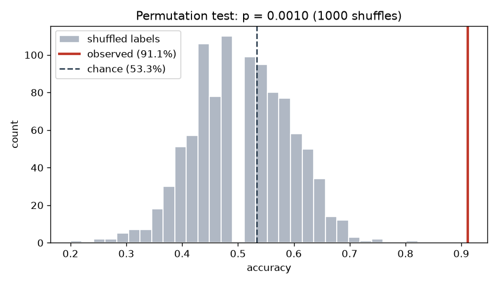
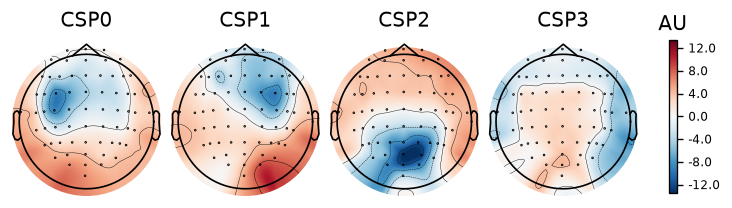

# EEG Motor-Imagery Decoding

Decoding *imagined* movement from scalp EEG with a classic **CSP + LDA**
baseline. When you imagine moving, your sensorimotor cortex changes its
mu (8–12 Hz) and beta (13–30 Hz) rhythm power in a spatially specific way;
this project reads that pattern to guess which movement was imagined.

**Dataset:** [PhysioNet EEGBCI](https://physionet.org/content/eegmmidb/1.0.0/)
motor-imagery set (109 subjects, 64-channel EEG @ 160 Hz), loaded via
`mne.datasets.eegbci`. This baseline uses **subject 1**, runs 6/10/14
(Task 4 = imagine *both fists* vs. *both feet*).

## Pipeline

```
raw EEG  →  average reference  →  band-pass 8–30 Hz  →  epoch around cues
         →  crop to 1–2 s imagery window  →  CSP spatial filters
         →  log-variance features  →  LDA  →  cross-validated accuracy
```

- **Filtering** keeps only the mu/beta motor rhythms; applied to the
  continuous signal (not epochs) to avoid edge artifacts.
- **CSP (Common Spatial Patterns)** learns channel-weightings that maximize
  the variance ratio between classes — a handful of spatial filters that
  separate hands from feet. The log-variance along the top axes is the feature.
- **LDA** separates the two feature clouds with a linear boundary.
- **Stratified 5-fold cross-validation** tests every trial exactly once and
  holds class balance steady across folds.
- **A 1000-shuffle permutation test** asks whether the result could have come
  from chance at all.

## Result

| Metric | Value |
|---|---|
| CSP+LDA accuracy (stratified 5-fold CV) | **91.1%** |
| Chance (majority class) | 53.3% |
| Permutation test (1000 shuffles) | **p ≤ 0.001** (null 50.7% ± 8.5%) |
| Wilson 95% CI on n=45 | [79.3%, 96.5%] |
| Per-fold scores | 8/9, 8/9, 8/9, 8/9, 9/9 |
| Trials | 45 (21 hands, 24 feet), one subject |

The per-fold row appears instead of a ± because a 9-trial test set can only score multiples of
1/9. A standard deviation over those five values is a step on that ladder, not a spread, which is
the same objection that retired the earlier "± 5.6%" below. Take the Wilson interval as the
honest uncertainty, and as mildly optimistic: it treats 45 cross-validated predictions as
independent draws from one model when they come from five. `p = 0.0010` is reported as **p ≤
0.001** because 1/1001 is the resolution floor of a 1000-shuffle test, not a measurement.

Shuffled labels never once beat the real result across 1000 permutations, so the
decoding is finding real structure rather than fitting noise:



The evidence that this is motor activity and not eye or muscle artifact is an
**ablation**, not a picture:

| Channels used | Accuracy |
|---|---|
| sensorimotor only | **95.9%** |
| all 64 | 91.1% |
| frontopolar only | **47.4%, i.e. chance** |
| leave-one-run-out (all 64) | 93.3% |

Remove the cortex that should carry the signal and the decoder collapses to
chance. Keep only that cortex and it improves. That is a control; a scalp map is
not.

The learned CSP patterns are plotted below because they are interesting, **not as
proof**. An earlier version of this README claimed they were "focal over central
sensorimotor cortex" and offered that as the artifact defence. That was wrong:
the strongest component here peaks at **POz, PO4 and Oz**, which is
parieto-occipital, and it correlates r = 0.57 with this subject's own eyes-closed
alpha map. Components 0 and 1 *are* genuinely sensorimotor (FC3/C3/FC1 and
FC4/FC2/C4). Reading topographies by eye is not a control, which is why the
ablation above replaced it.



### A note on the earlier number

An earlier version of this README reported **94.4% ± 5.6%** under "10-fold CV."
Two things were wrong with that. The evaluation was `ShuffleSplit`, which is not
k-fold: it never tested 5 of the 45 trials while testing others up to 6 times, and
it left class balance swinging from 2:7 to 7:2 across folds. And the ± 5.6% was a
quantization artifact rather than a spread, because a 9-trial test set can only
score multiples of 1/9, so the ten folds landed on just two distinct values.

Stratified 5-fold puts the figure at 91.1%, and the lower number is the better
claim because it now carries a significance test.

**But most of that 3.3-point drop is seed luck, not a correction.** Sweeping 100
cross-validation seeds gives a mean of 93.6% for ShuffleSplit and 93.8% for
stratified 5-fold, so the two estimators agree in expectation to about 0.2 points.
Seed 42 happens to sit at the 49th percentile for the old estimator and the **3rd
percentile** for the new one. The estimator change is still right, for coverage
and stratification reasons, but it is worth roughly 0.6 points, not 3.3. The
published 91.1% is a conservative draw from an 88.9-97.8% seed distribution.

`evaluate_honestly.py` reproduces the whole comparison, sweeping both estimators
so that neither one's diagnostics get attached to the other's number.

## Honest limitations

- **Within-subject, small-n.** One subject, 45 trials. The number does not claim cross-subject
  generalization, and the honest interval is roughly [79%, 97%].
- **Easy contrast.** Fists vs. feet are far apart on the motor homunculus (lateral vs.
  top-central), so their scalp patterns differ a lot. Left-hand-vs-right-hand is harder, and
  `harder_contrast.py` found it is also **gaze-confounded** in this dataset: a decoder using only
  frontopolar channels at 0.5–5 Hz matches the 64-channel result on this subject.
- **Clean subject.** Subject 1 is the **91st percentile** of the 109; the median subject scores
  60.0%. Picking it is fair for a baseline, and quoting it without the distribution would not be.
- **No artifact rejection.** No ICA, and EEGMMIDB ships no EOG channels, so ocular contamination
  can be bounded by ablation but never removed or directly measured.

## Reproduce

```bash
python -m venv .venv && source .venv/bin/activate
pip install -r requirements.txt
python decode_csp.py        # full pipeline + CSP patterns → csp_patterns.png
```

Data downloads automatically on first run (cached in `~/mne_data`).

### Scripts (built rung by rung)

Rungs 1–4 build the result. Rungs 5–11 attack it, and three of them found something wrong.

| # | Script | Does |
|---|---|---|
| 1 | `load_and_plot.py` | Load one run, plot raw EEG → `raw_eeg.png` |
| 2 | `epoch_trials.py` | Cut runs 6/10/14 into labeled hands/feet trials |
| 3 | `filter_and_epoch.py` | Add 8–30 Hz band-pass + average reference |
| 4 | `decode_csp.py` | CSP + LDA, cross-validated, permutation test, spatial patterns |
| 5 | `evaluate_honestly.py` | Stress-test the number: stratification, coverage, permutation test, 100-seed sweep of both estimators |
| 6 | `sweep_subjects.py` | All 109 subjects, per-subject chance, against the pure-noise expectation |
| 7 | `harder_contrast.py` | Left vs. right fist (runs 4/8/12). Found a lateralised gaze confound |
| 8 | `cross_subject.py` | Leave-one-subject-out across 20 subjects |
| 9 | `riemannian.py` | MDM and Tangent Space vs. the CSP baseline on identical folds |
| 10 | `eegnet_compare.py` | EEGNet vs. CSP+LDA at two sample sizes. Where the units bug was found |
| 11 | `regime_decomposition.py` | Decomposes rung 10's confounded third regime into band × window |

## Next

Cross-subject, harder contrasts and the EEGNet comparison are all built now (rungs 7–11). What
is actually left:

- **More trials per subject.** Almost every limitation above traces back to 45 trials: the
  quantized folds, the underpowered comparisons, the learning curve that cannot be run. Public
  corpora exist with 2,000–5,000 trials per subject.
- **Filter-bank CSP (FBCSP).** CSP per sub-band, combined by the classifier. A reliable gain, and
  still classical and interpretable.
- **The learning curve**, holding subject fixed and sweeping training-set size. That would settle
  a claim this project made and then retracted, that the barrier is sample size rather than
  anatomy.
- **ICA-based artifact rejection**, and a paradigm that records EOG.

See [EXPLAINER.md](EXPLAINER.md) §12 for the full scoreboard, including the five claims this
project published and later retracted.
